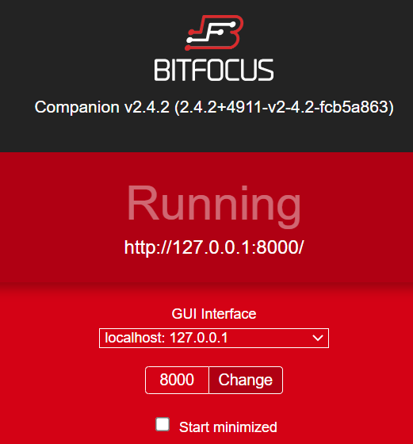
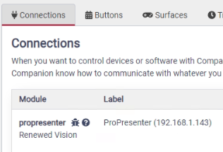
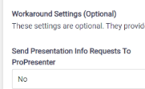
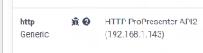
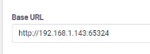

# How to Install

An installer should have this software installed: 

 - Renewed Vision ProPresenter 7.x.x
 - Bitfocus Companion 2.4.2

 Note: The example install showes Companion and ProPresneter running on different computers so refers to 2 IP addresses.  Expected that this would work if they were installed on the same computer.

Also that the installer has reviewed:

- [Dependencies](README.md#dependencies)
- [Validated Environment](README.md#validated-environment)

## Customizing for your configuration

Please keep track of these values for your environment because they can be different from the examples in this install guide.  You will need to set the accordingly.

| Item | Value in examples |  Record your value |
| :--- | :--- | :--- |
| ProPresenter IP address | 192.168.1.143 |  |
| ProPresenter Remote Port | 65324 |  |
| Companion IP address | 192.168.1.106 | |
| Companion Port | 8888 | |
| Location of Powershell script | c:\tbd  | |

## Install Steps

### 0 Add Companion Connections

#### ProPresenter Module

#### HTTP Generic Module

### 1 Pick a unused Companion button page

### 2 Display the Companion button page as a website

### 3 Define Companion Variables

### 4 Define Companion Triggers

### 5 Add Powershell Script on Companion Computer

## Useing the Simple Remote
