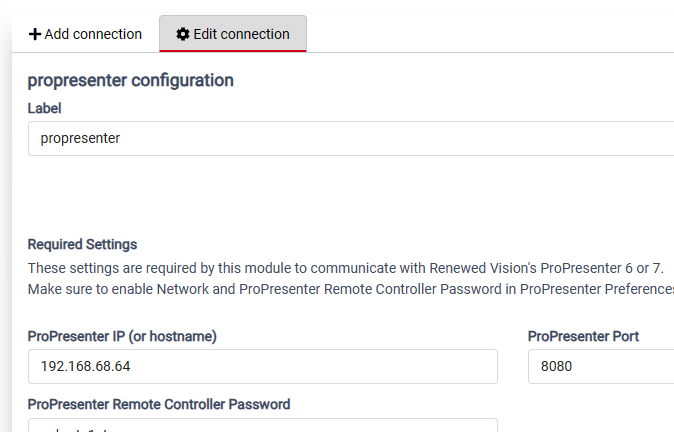
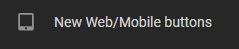

# How to Install

An installer should have this software installed: 

 - Renewed Vision ProPresenter 7.x.x
 - Bitfocus Companion 2.4.2

 Note: The example install showes Companion and ProPresneter running on different computers so refers to 2 IP addresses.  Expected that this would work if they were installed on the same computer.

Also that the installer has reviewed:

- [Dependencies](README.md#dependencies)
- [Validated Environment](README.md#validated-environment)

## Customizing for your configuration

Please keep track of these values for your environment because they can be different from the examples in this install guide.  You will need to set the accordingly.

| Item | Value in examples |  Record your value |
| :--- | :--- | :--- |
| ProPresenter IP address | 192.168.68.64 |  |
| ProPresenter Remote Port | 8080 |  |
| Companion IP address | 192.168.68.64 | |
| Companion Port | 8000 | |
| Location of Powershell script | c:\_File_Area\Companion\ | |
| Selected Companion Button Page | 5 | |

## Install Steps

### 0 Add Companion Connections
Assumption: You have ProPresenter and Companion installed on computers.

Note the IP address and port used by the ProPresenter computer.  They can be found in ProPresenter\Preferences\Networking.  Make sure "Enable Network" is checked.

Note the IP address and port used by the Companion computer.  They can be found on the Companion startup screen.
If Companion is using "localhost" like the first example, user the dropdown box to change it to the computer IP address.

> 

> 

#### 0.1 ProPresenter Connection
If you already have the ProPresenter module added as a connection then verify:
- Label is the default of "propresenter".   (If not, there will be an extra step if you import the buttons.)
- Status has the green "OK" when ProPresenter is started.

> 

If needed, use "+Add connection" to add the ProPreenter module.
- Do not change label from the default of "propresenter".
- Configure the ProPresenter IP address, port and remote control password.  (Not sure if password is needed but not tested.)
- Recommend setting "Send Presentation Info Requests To ProPresenter" be set to "No".

> 

> 

#### 0.2 HTTP Generic Connection
We will instal a new "HTTP Generic" connection later.

Please record any HTTP Generic connections that already exist (if any) along with their labels and connection strings.  This is just a precaution incase they are accidentally overwritten.

>

>

### 1 Create a web URL that will be the remote
Next we will create the URL that folks can use for the web remote

#### 1.1 Pick an unused Companion button page
Select an button page in Companion that is not being used.  In these instructions we used page 5.

>

Change the name of the page from "Page" to "New".

### 1.2 Display the Companion button page as a website
On the left menu in Companion, press "New Web/Mobile buttons" to open a new page.  Then on that page press the Configure button on the right.

> 

> 

Make these changes:
- Set Pages to the page number you chose.
- Set Columns to 3.
- Check "Hide fullscreen button"
- Check "Hide configuration button"
- Close the Configuration

**Save the URL to use on any device as the simple remote!**
- Example: http://192.168.68.64:8000/tablet3?cols=3&noconfigure=1&nofullscreen=1&pages=5

The result should look like this.

>

### 2 Define Companion Variables

#### 2.1 PresText1 to PresText12

Create 12 custom variables called "PresText1" to "PresText12".

Make the "Startup value:" be the number after "PresText".

> 

##### 2.2 PresPrevPath

Create a custom variable called "PresPrevPath" with a "Startup value:" of "0:0".

>

### 3 Create Companion Buttons

Creating the buttons can be done with the quick option or the long option.

The quick option imports the buttons.  The long option is manually keying them in.

#### 3.1 Quick Option - Import page

In Companion, go to the button page that you selected. Select "Import" on the "Import / Export" tab.

> 

Open the file called Buttons_page6.companionconfig.

Dependency: The label on the ProPresenter connection must be the default of "propresenter".

> 

Before pressing "Import to page x", under "Select connection" change the pulldown to [Create new connection].
That way the import will not overwrite an existing Generic HTTP connection.

> 

On Connections, find the new "http generic" connection.  It should be at the bottom of the list and use the next sequential label depending on how many previous "http generic" connections you had.

Edit the connection and change the "Base URL" from "http://localhost:8080"  to use the ProPresenter IP address and port number.
- `http://<ProPresenter-IP>:<ProPresenter-port>`

> 

#### 3.2 Long Option - Key in 12 buttons

To Do: If the quick import works for most folks, then is this detail needed?

### 4 Pause to review
At this point you should be able to use the simple remote to switch between the first 12 slides in a presentation.  The buttons should turn red for the active slide and green for the slide after.

The next steps (5 and 6) are a bit of work that only change the buttons to say "no slide" if a presentation has less than 12 slides.

### 5 Define Companion Triggers
In Companion, select the "Triggers" tab. At the bottom press "Add New Trigger".

Name: "PRESentation - select different presentation"
Type: feedback

Delete the existing "Condition"

Under Condition, add this feedback:

    - Internal: Compare vairable to variable
        - compare variable: Current Presentation Path
        - Operation: !=
        - Against Variable: PresPrevPath

Under Action, check Relative Delays.  Then add these 2 actions.

    - Internal: Run shell path (local)
        - Delay: 10 ms
        - Path: powershell.exe -noprofile -noninteractive -file "C:\_File_Area\Companion\Get-PNG.ps1" -proP "192.168.1.143:65324" -compP "192.168.1.106:8888"
            - Note: put in your own ProPresenter IP address and port, then the Companion IP address and port.
            - powershell.exe -noprofile -noninteractive -file "C:\_File_Area\Companion\Get-PNG.ps1" -proP "192.168.68.64:8080" -compP "192.168.68.64:8000"
        - Timeout: 10000
        - Target Variable(stdout): None
        
    - Internal: Store variable value to custom variable
        - Delay: 30 ms
        - Custom Variable: PresPrevPath
        - Varable to store value from: Current Presentation Path

Save it!

### 6 Add Powershell Script on Companion Computer

Create this folder structure c:\_File_Area\Companion\.

Copy Get-PNG.ps1 from this repository and place it in that folder.

## Useing the Simple Remote

Have Companion and ProPresenter running.  In ProPresenter, have the operator activate the first slide in a presentation.  
- We use the week's sermon presentation.

Have the presenter open the URL you saved above in a browser.
- We use the presenter's phone.  Yes, the phone is on WiFi and the Companion and ProPrester computers are hard wired.
- Natrually, the presenter's device has to be on the same network as the Companion and ProPresenter computers.

The button corresponding to the slide selected by the operator should be red and the next one should be green.

The presenter can press any button and ProPresenter should display the corresponding slide. 

Intentional limitations:
- The simple remote does not allow the presenter to switch presentations.  It only activates slides in the currently active presentation.
- The simple remote handles up to the first 12 slides of a presentation.
