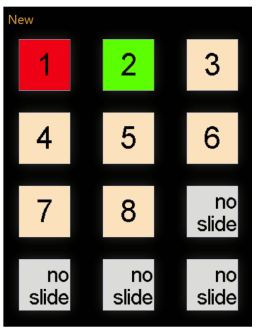

# ProPresenterRemote
Simple remote to change which slide is displayed in the active ProPresenter presentation.  The remote is a Companion web page.

## Example

This URL on a phone displays the screen below.

http<nolink>://192.168.1.106:8888/tablet3?cols=3&noconfigure=1&nofullscreen=1&pages=5
  

Notes:

    - In the above example, 192.168.1.106 is the address of the computer running Companion.  You would need to change this to the address in your environment.
    - The current presentation has 8 slides.  (max supported is 12)
    - The active slide is the first one, shown in RED.
    - The recommended next slide is the second one, shown in GREEN.
    - Any numbered slide selected will make that the active slide.

## Dependencies

The following are dependencies for this solution:

 - BitFocus Companion running on Windows.  This is a dependency because a PowerShell script contains core logic.
 - BitFocus Companion running the ProPresenter and Generic HTTP modules.
 - ProPresenter  7.x.x with a version that has the new API.  (API 2 ?)

## Validated Environment

The folowing details note where the code has been validated:

 - BitFocus Companion 2.4.2 installed on Windows 10.
     - No known reason why this would not also work on Companion 3.x, but not tested.
 - ProPresenter 7.13 running on a MAC.
     - No known reason why this would not also work with ProPresenter on Windows, but not tested. (Depends on ProPresenter API.)
     - Ran on earlier versions of ProPresenter 7.x.  Just don't remember what they are.  (Could have been 7.10.)

## How to Install

See [Install.md](Install.md)